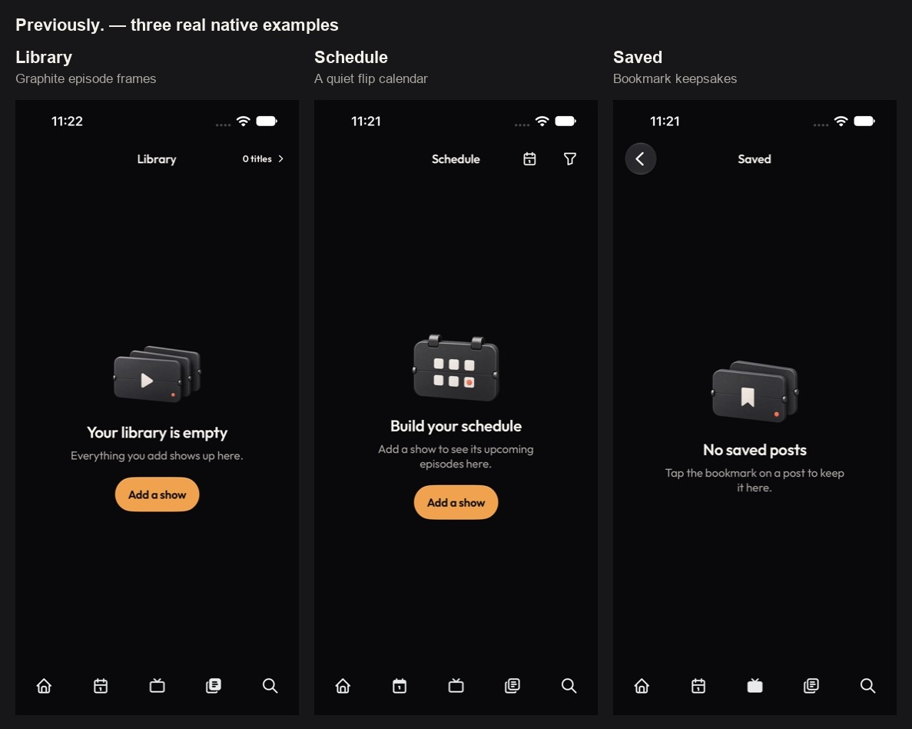
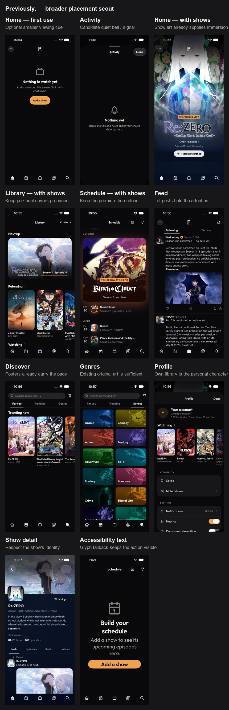

# Previously. artwork placement map

The first Library example was not the full scope. This pass covers the current root screens,
social subpages and the remaining state call sites. The app already has strong show imagery and
a split-flap brand identity. Original decorative art works best at a useful pause, with the
message and action retaining the visual lead.

## Three implemented native examples

The [login follow-up](../login/BACKDROP.md) adds a fourth example: a cozy welcome background,
with the current split-flap mark carried into the credential sheet. This supersedes the earlier
decision to leave the entire sign-in flow untouched.

[Before and after](native-before-after.jpg). These are exact screenshots of the existing SwiftUI
app, arranged with labels outside the UI. They are not generated screen mockups.

| Place | Example | Scope and evidence |
| --- | --- | --- |
| Empty Library | Graphite episode frames with ivory play mark and coral period | Implemented only for the empty account; [native capture](06-library-current.jpg) |
| First-use Schedule | Graphite hinged calendar, ivory grid, tiny coral date cue | Implemented only when the library is empty; [native capture](03-schedule-after.jpg) |
| Empty Saved posts | Two graphite panels with an ivory bookmark | Implemented only after a successful empty response; [native capture](04-saved-after.jpg) |

Each transparent illustration occupies 128 × 100 points above existing copy. Recovery states
retain their symbols. Accessibility text sizes omit artwork and use the existing scaled glyph.
Art is decorative and hidden from VoiceOver. No animation or new controls were added.

## Remaining opportunities, ranked

| Priority | Place / trigger | A restrained example | Current evidence / decision |
| --- | --- | --- | --- |
| Medium | Empty Activity | Small graphite bell or folded signal panel, one coral indicator | [Actual empty Activity](02-activity-empty-before.jpg); next candidate, unchanged in this pass |
| Medium | Home when fully caught up | A resting episode panel or compact completed flap | Existing `HomeView.caughtUp` verified in source; this exact state was not rendered. A smaller cue than Library, rather than a large reward scene |
| Medium | A stocked Library's clear Schedule | Closed calendar, one ivory line | Existing `.nothingScheduled` branch verified in source; this exact state was not rendered. Reuse the calendar family rather than a new visual language |
| Low | Empty Home / first use | One small viewing panel | [Actual empty Home](../scout/03-home-empty.jpg); repeats the same invitation as Library, so lower value |
| Low | Real series completion | Tiny embossed completion mark beside the existing status acknowledgement | Source has a commit-bound milestone treatment on the status pill. A small optional replacement/enhancement, not a new trophy screen. No fake completion was created |
| Low | Existing notification primer after adding a show | Tiny bell miniature at roughly the existing glyph size | Existing inline row verified in `DiscoverView`; exact primer not captured. Preserve its compact, one-time grammar rather than expanding it into a promo card |
| Edge case | Watch history with no sessions | Small archive/timeline motif | Empty state exists in source, but the entry is hidden until sessions exist; the page also has a show-art backdrop. Do not prioritize this as a common first-use moment |

## Surfaces checked and deliberately left alone

| Surface | Decision |
| --- | --- |
| Populated Home and Schedule | Existing show and premiere heroes already provide immersion; decorative art would compete |
| Populated Library / All titles | Personal covers, shelves and progress provide character; no background illustration |
| Discover / search launchpad | Trending posters already fill the browsing surface; retain focus |
| Genre grid | Existing original genre art is already abundant; the premature four-art replacement experiment is retired |
| Feed / post / comments / compose | Reading and conversation need space; no added decorative layer |
| Profile | Actual library covers provide personal meaning; no generic profile scene |
| Show detail / populated watch history | Show imagery and real viewing records provide the visual identity |
| Sign-in / launch | Keep the existing `P.` launch anchor. The [welcome now has a cozy room backdrop](../login/BACKDROP.md); provider and credential forms stay plain with the current logo |
| Filters / search with no matches | Keep the practical glyph and recovery action |
| Offline / failed loads / removed posts / suspension | Keep clear recovery semantics rather than playful imagery |
| Muted / blocked / account controls | Utility screens; keep their neutral symbols |
| Retired recap | Not part of the active app; excluded from placement scope |

This is the current placement inventory, not a claim that every future feature needs an image.
The strongest next candidate is Activity; Home caught-up and clear Schedule come after it.

## Verification and reproduction

The Debug AniTrack build passed on iPhone 14 Pro / iOS 27.0 (27.2 seconds; six existing warnings).
[Build receipt](build.log), [verification record](verification.json). `git diff --check` passed.
[Larger-text Schedule](05-schedule-accessibility.jpg) retains readable copy and an onscreen action,
with artwork omitted. This used the accessibility XXXL launch preference; the app's existing
text-size cap remains. The Saved fallback shares the same primitive but was not separately captured.

The app uses a loopback preview adapter and local sign-in shell. The empty responses are explicit
preview states, not a claim about a live account. Earlier populated screenshots use real catalogue
records and a read-only 43-title library snapshot. No production account or backend was modified.
The adapter's Saved route was corrected from `/me/saves` to `/me/saved`; the earlier error capture
`00-saved-preview-error.jpg` is adapter-failure evidence and is excluded from the scout boards.

Capture routes: `-openTab library`, `-openTab schedule`, and `-openTab feed -openSaved 1`, with
`-anitrack.devClerkId artwork-preview-local`. Build overrides:
`API_BASE_URL=http://localhost:18789`, `CLERK_PUBLISHABLE_KEY=`. No production settings changed.
Native captures prove rendering. Touch navigation, real-device validation and distribution remain
unverified. No TestFlight upload, commit or push was performed.

Generated originals and exact prompts are retained in `../source/` and [prompts.json](prompts.json).
Built-in Image Gen exposes no model selector, so Sunburst was not selected or verified.
The packaging scripts only crop transparent padding and resample generated alpha; no semantic
image editing or recoloring was performed. These are original objects, without show characters,
actors, fictional settings or studio branding.
