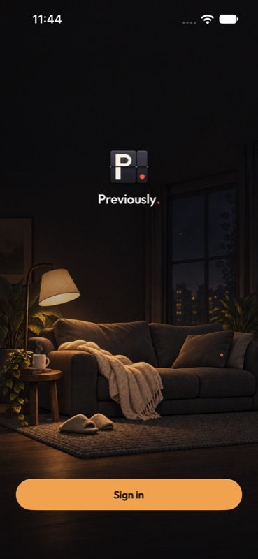

# Cozy welcome backdrop

The user's requested direction is now a background room rather than a small inline vignette.
Image Gen extended the same sofa, blanket, lamp, table and nighttime window into an opaque
portrait scene. The brand remains over a quiet dark wall; the room fills the lower half.

The welcome screen draws the background edge to edge beneath a compact `P.`, wordmark and
Sign in action. Following the user's feedback, the invented slogan is removed entirely and the
welcome mark is reduced from 120 to 56 points. The wordmark uses the existing 20-point brand
style instead of the 34-point display style. The compact identity is centered at 32% of screen
height. The launch screen retains its existing display-scale identity; its transition was not
verified in this revision.

A dark gradient protects the brand and bottom action. Larger-text mode adds a little more dimming; background art
consumes no layout space, is hidden from accessibility and cannot intercept taps. There is no
blur, parallax or new animation.

## Checks

1. Ordinary-text welcome: actual iPhone 14 Pro native rendering reviewed; compact branding and
   Sign in remain visible, with no slogan. [Capture](10-welcome-compact.jpg).
2. Larger-text welcome: actual native rendering reviewed; text and Sign in remain visible over
   the dimmer scene. [Capture](11-compact-accessibility.jpg). The existing text-size cap remains.
3. Credentials: prior native public sheet check remains valid; its local `P.` override and form
   behavior were unchanged by this backdrop revision. Successful sign-in and recovery remain
   untested. No credentials were entered or OAuth started.

Debug AniTrack build passed in 19.2 seconds, and `git diff --check` passed.
[Build receipt](build-v4.log). The preview uses
the project's existing development Clerk configuration and loopback app API. Native captures prove
rendering; semantic touch navigation, small-device rendering, real-device validation and
distribution are not claimed. Production settings, backend data and provider configuration are
unchanged. No upload, commit or push was performed.

The previous larger lockup and slogan are preserved in the historical v3 captures and
`verification-v3.json`. Current evidence is in [verification-v4.json](verification-v4.json).
The user approved this revision for implementation, commit, push and TestFlight on 2 October 2026.

## Assets

- [Selected original portrait](../source/login-cozy-backdrop-v3.png)
- [Exact Image Gen prompt](prompt-v3.json)
- Asset catalogue: `ios/Resources/Assets.xcassets/login-cozy-backdrop-v3.imageset/`
- `package-backdrop.py` preserves composition and only resizes / JPEG-encodes the output.
  The packaged @2x/@3x JPEGs total 333,000 bytes. The source is 853 × 1844 pixels; the @3x
  image retains that resolution rather than inventing additional detail through upsampling.

Built-in Image Gen was used; its model selector is unavailable, so Sunburst was not verified.
The earlier transparent inline v2 imageset is removed from the active catalogue and preserved
under `retired-v2/`. All earlier sources, prompts and native captures remain available. The
backdrop is an original environment without show characters or known fictional locations.
