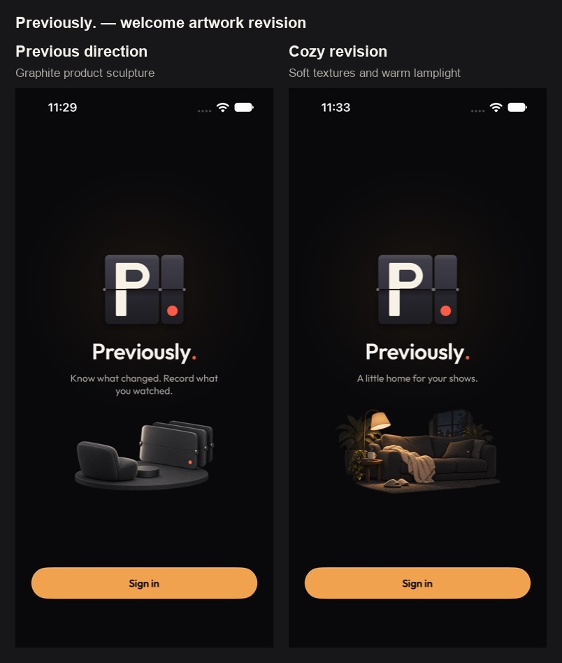
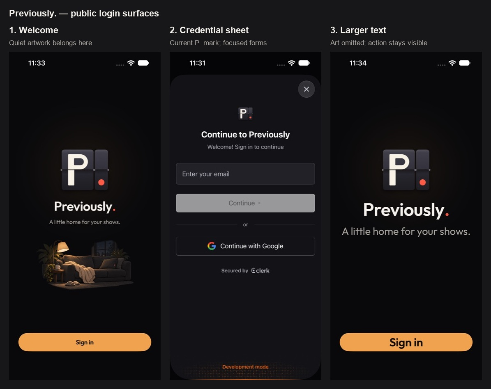

# Previously. login artwork

The [current backdrop revision](BACKDROP.md) supersedes this inline v2 treatment. The report
below preserves the native v2 findings and the credential-sheet branding check.

Login is a useful artwork placement. The earlier scope excluded it too broadly because the brand
mark was already present. Fresh native captures show room between the welcome line and Sign in.

The user's next feedback was that the graphite chair/panel sculpture did not feel cozy or
comforting. The current revision uses a warm nighttime nook, a soft throw and quiet lamplight,
plus the line **A little home for your shows.** The app keeps its near-black canvas, split-flap
`P.`, wordmark and sign-in action. This is an original scene without known characters or show IP.

## Public flow steps

| Step | Surface | General health / artwork decision |
| --- | --- | --- |
| 1 | Welcome / login entry | Native rendering verified. Original cozy illustration below the tagline; 260 × 156-point maximum slot. The logo and action remain dominant |
| 2 | Email / Google entry sheet | Native rendering verified. Keep forms free of new artwork. The old dashboard ribbon was visible in the original capture; the app now overrides that slot with its current `PreviouslyMark` through Clerk's public `clerkAppIconView` API |
| 3 | Larger-text welcome | Native rendering verified. Art is omitted and the welcome copy and action remain readable. The app's existing text-size cap remains |
| 4 | Provider authorization, code verification, password recovery and session completion | Not exercised. No credentials entered or OAuth started. Keep these focused on their existing form and recovery semantics |

## Implementation and checks

- `SignInView` keeps the original launch/mark coordinates. Decorative art is hidden from
  accessibility and adds no animation or delay. It is omitted below 780 points of viewport height,
  at accessibility text sizes, and when Clerk is unconfigured. Short-device rendering was not
  captured; that guard was inspected in source.
- The installed Clerk package resolves to 1.5.7. Its public custom-logo slot is used locally;
  dashboard settings and auth methods were not changed. The public sheet's native capture shows
  email and Google, in the project's configured development Clerk environment.
- Final Debug Previously build passed on iPhone 14 Pro / iOS 27.0 in 31.6 seconds. Seven warnings
  were in unchanged FeedHeader, Home, Library, Discover and detail code; no new auth warnings.
  [Build receipt](build-v2.log). `git diff --check` passed.
- Native screenshots prove rendering. The semantic Sign in tap reported success without changing
  the screen, so navigation is not claimed as verified. The actual public sheet was captured using
  a DEBUG-only `-signInCaptureSheet 1` presentation hook; the normal preview ends with this flag off.
- No production API, credentials or signed-in account was used. The build retains the project's
  existing public development Clerk key and overrides the app API to the loopback preview adapter.
  No release, real-device validation, TestFlight upload, commit or push was performed.

Source: `../source/login-cozy-viewing-nook-v2.png`. Exact generation prompt: [prompt-v2.json](prompt-v2.json).
Built-in Image Gen was used; model selection is not exposed, so Sunburst was not verified.
`package-artwork.py` only crops transparent padding and resamples the generated alpha to @2x/@3x
PNGs (591,241 image bytes). The rejected v1 source, prompt and captures are preserved; its imageset
is removed from the active catalogue and retained under `retired-v1/`.

Reproduce the welcome with `-signInCaptureSheet 0 -previously.devClerkId ""` on a configured-Clerk
Debug build. Use `-UIPreferredContentSizeCategoryName UICTContentSizeCategoryAccessibilityXXXL`
for the larger-text check. These previews do not prove successful authentication.
