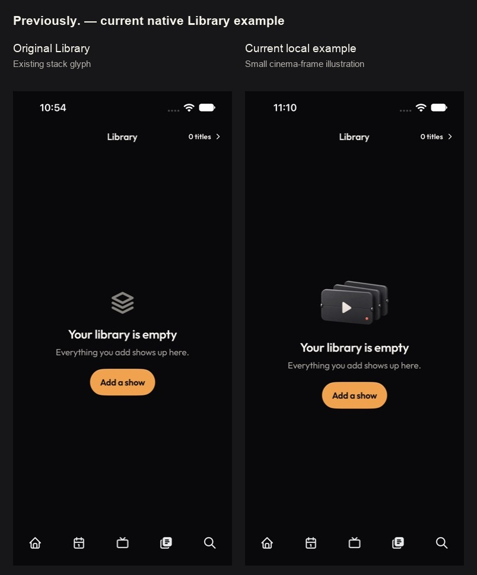
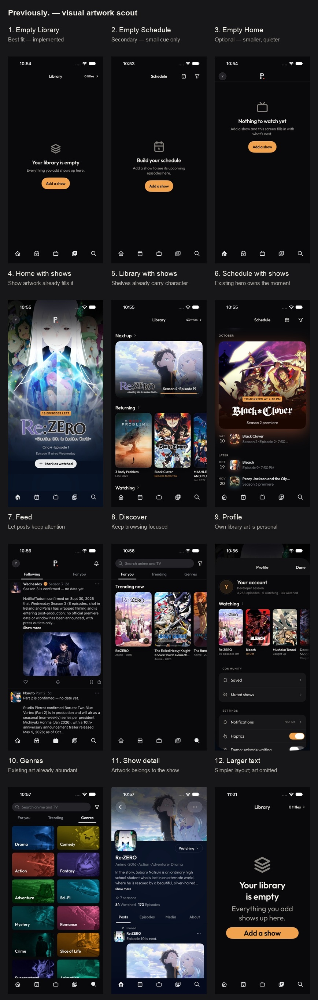

# Artwork placement scout — Previously.

Scouted the actual SwiftUI app on 2 October 2026 using current-run native screenshots. The goal
is quiet personality in useful pauses. This file records the first pass; the
[expanded current scope](../expanded/SCOPE.md) includes three implemented native examples and
the remaining state candidates.

The user found the first cream/fabric archive object attractive but inconsistent with the app's
theme and character. The current revision follows the graphite split-flap identity, with an ivory
play mark and small coral period. [Native v1/v2 comparison](library-theme-v2.jpg).

## Placement decisions

| Priority | Place | Visible reason | Appropriate treatment |
| --- | --- | --- | --- |
| 1 — implemented | Empty Library | Centered first-use message, substantial free space, one clear action | Small graphite hinged-frame illustration replacing the generic stack glyph; ivory play mark and coral period |
| 2 — candidate | First-use Schedule | Centered invitation with ample space; upcoming episodes are the promise | Small original calendar or folded episode card in the same quiet material vocabulary, only for first use |
| 3 — optional | Empty Home | Message sits in the upper portion of the screen | A smaller viewing motif; give Library and Schedule priority to avoid repetition |

Home and Schedule with shows already have large artwork. Library shelves, feed posts and show
details get their character from actual shows. Profile's library covers are personal and relevant.
Discover's genre grid already has abundant artwork. The populated screens do not need another
decorative layer.

Caught-up Home, clear Schedule for a populated account, sign-in and milestones remain future
possibilities. Their exact states were not captured here. A feed caught-up launch anchor did not
move the preview and is not treated as evidence of that state.

## Current screen evidence

Review sheet images are resized for comparison. These links open exact captures. Populated
screens use real catalogue records and a read-only 43-show library snapshot. First-use states
use empty responses from the loopback preview adapter.

| No. | Screenshot | Finding |
| --- | --- | --- |
| 1 | [Empty Library before](01-library-empty-before.jpg) | Strongest placement: generic glyph above a clear message and action |
| 2 | [Empty Schedule](02-schedule-empty-before.jpg) | Secondary placement; same centered first-use grammar |
| 3 | [Empty Home](03-home-empty.jpg) | Higher placement calls for a smaller cue |
| 4 | [Home with shows](04-home-populated.jpg) | Full-height Re:ZERO artwork already creates immersion |
| 5 | [Library with shows](05-library-populated.jpg) | Next up hero and Returning shelf already carry artwork |
| 6 | [Schedule with shows](06-schedule-populated.jpg) | Premiere artwork owns the visual hierarchy |
| 7 | [Feed](07-feed.jpg) | Posts and their pictures need reading space |
| 8 | [Profile](08-profile.jpg) | Own library covers provide relevant personality |
| 9 | [Discover](09-discover.jpg) | Trending posters dominate browsing |
| 10 | [Genres](10-discover-genres.jpg) | Existing colored genre pictures fill the screen |
| 11 | [Show detail](11-show-detail.jpg) | Show-specific artwork and posts occupy the surface |

## Implemented example checks

- [Current empty Library](15-library-flap-v2.jpg): compact transparent illustration, readable
  copy, existing amber action, intact header and flush navigation.
- Prior v1 [accessibility text](13-library-accessibility.jpg): art omitted; message wraps cleanly and the
  action stays visible. Captured with the accessibility XXXL UIKit launch preference; the app
  retains its existing text-size cap.
- Prior v1 [populated Library](14-library-populated-after.jpg): existing 43-title library and poster
  shelves render without the empty-state illustration.
- Debug simulator build passed; `git diff --check` passed. Receipt: `../quiet-build.log` and
  `../verification.json`. Current build log is `../quiet-build-v2.log`. V1 accessibility and
  populated-layout checks were not repeated for the v2 asset-only revision.

These are local simulator rendering checks. Touch navigation could not be verified because the
semantic tap tool reported success without moving the UI. No account writes, production release,
TestFlight upload or real-device check was performed.

## Asset and reproduction

[Selected generated source](../source/empty-library-episode-frames-v2.png) and
[exact prompt](../quiet-artwork-prompt-v2.json). Built-in Image Gen was used; Sunburst selection
is not exposed by that tool.

Build the existing Previously project/scheme with loopback API and blank Clerk overrides. Launch
`-openTab library -previously.devClerkId artwork-preview-local`. The adapter defaults to empty
responses. Local `preview-mode.txt` containing `populated` selects the ignored real-library
snapshot. Populated previews use actual records and progress.
